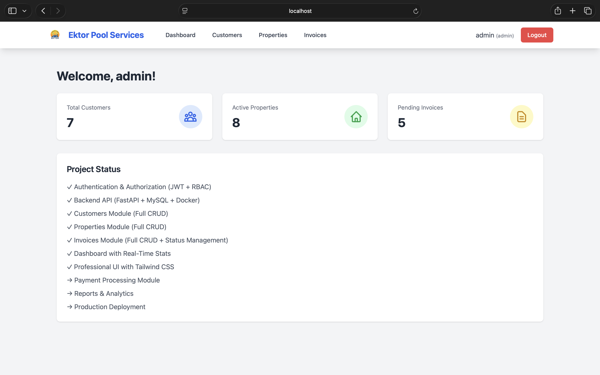
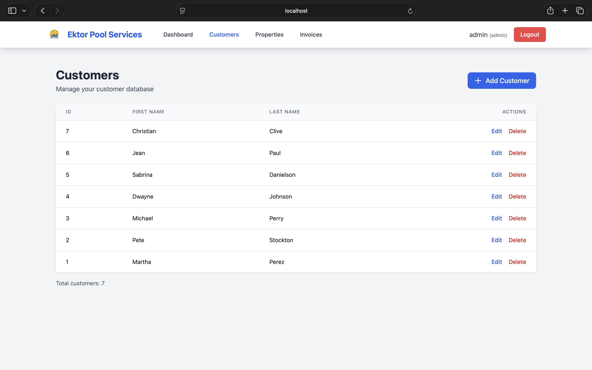
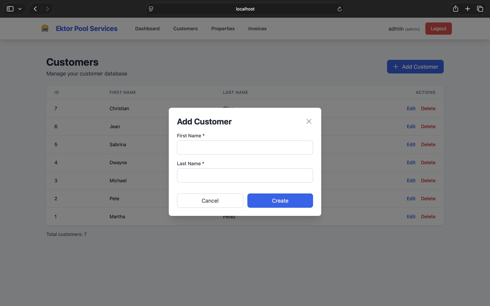
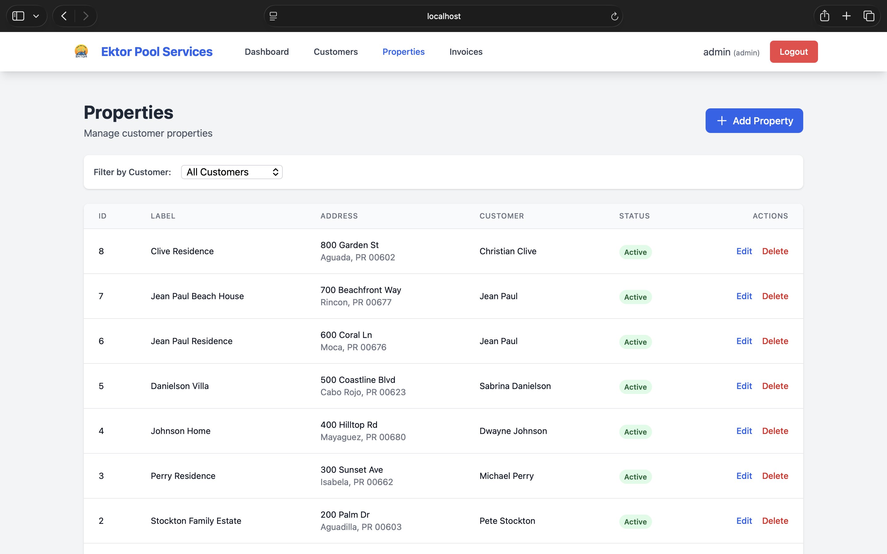
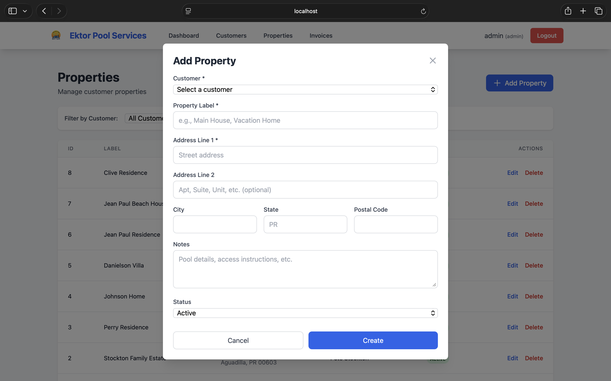
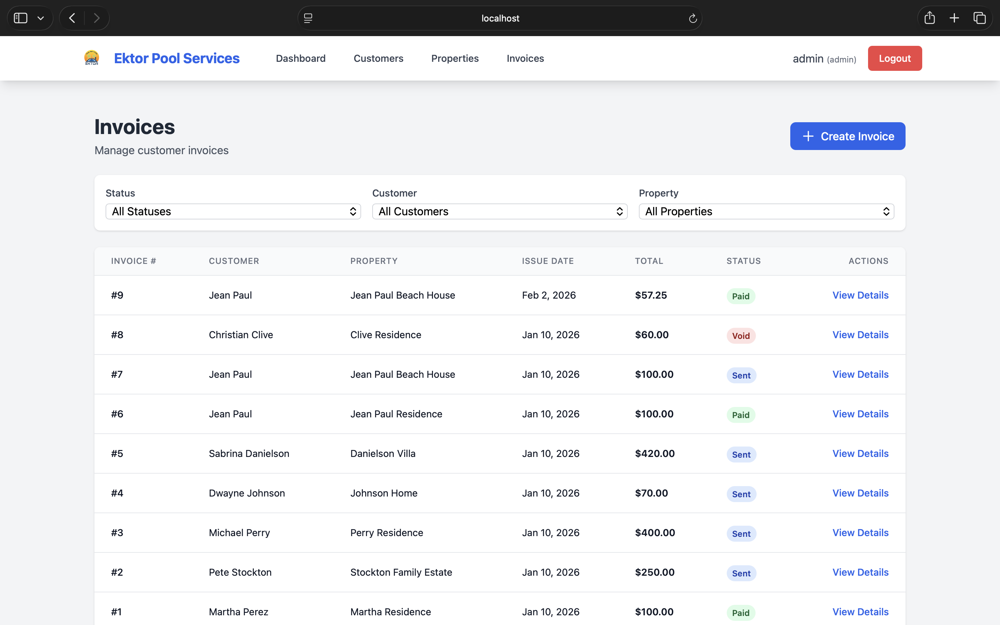
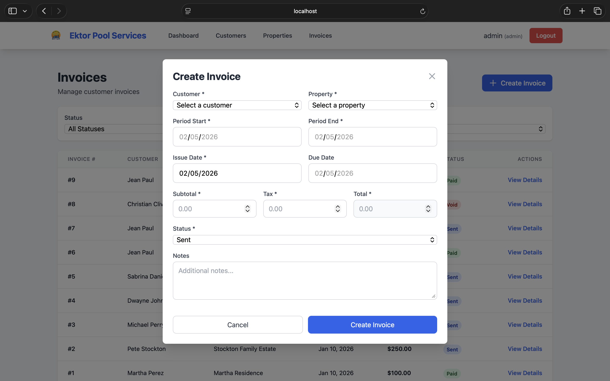

# Ektor Pool Services - Full-Stack Management System

<div align="center">
  
  
  **Complete pool maintenance business management application**
  
  [](https://www.python.org/)
  [](https://fastapi.tiangolo.com/)
  [](https://reactjs.org/)
  [](https://www.mysql.com/)
  [](https://www.docker.com/)
</div>

---

## Overview

A professional full-stack web application for managing a pool maintenance business. Built from the ground up with modern technologies, this system handles customer management, property tracking, invoicing, and payment processing.

**Live Demo:** [Coming Soon]  
**Portfolio Project:** Built as a comprehensive demonstration of full-stack development skills for internship applications.

---

## Features

### Backend (FastAPI + MySQL)
- [x] RESTful API with 25+ endpoints
- [x] JWT authentication with role-based access control (RBAC)
- [x] Complete CRUD operations for all entities
- [x] Business logic validation and error handling
- [x] Automated testing with pytest (85% coverage)
- [x] Docker containerization with health checks
- [x] OpenAPI/Swagger documentation

### Frontend (React + Vite + Tailwind CSS)
- [x] Modern, responsive UI with professional design
- [x] JWT-based authentication with protected routes
- [x] Real-time dashboard with live statistics
- [x] Complete CRUD interfaces for:
  - Customer management
  - Property management
  - Invoice creation and tracking
  - Status management (draft → sent → paid → void)
- [x] Advanced filtering and search capabilities
- [x] Form validation and error handling
- [x] Loading states and user feedback

---

## Tech Stack

### Backend
- **Framework:** FastAPI 0.109
- **Database:** MySQL 8.0
- **ORM:** SQLAlchemy 2.0
- **Authentication:** JWT (OAuth2 + Bearer tokens)
- **Testing:** pytest, coverage
- **API Documentation:** OpenAPI (Swagger UI)

### Frontend
- **Framework:** React 18
- **Build Tool:** Vite 5
- **Styling:** Tailwind CSS 3
- **Routing:** React Router 6
- **HTTP Client:** Axios
- **State Management:** React Context API

### DevOps
- **Containerization:** Docker, Docker Compose
- **CI/CD:** GitHub Actions (planned)
- **Database Versioning:** SQL migration scripts

---

## Quick Start

### Prerequisites
- Docker Desktop installed and running
- Node.js 18+ (for local frontend development)
- Git

### Installation

1. **Clone the repository**
```bash
   git clone https://github.com/ektorg89/ektor-pool-services.git
   cd ektor-pool-services
```

2. **Start the backend with Docker**
```bash
   cd backend-v2
   docker compose up -d
```
   
   The API will be available at: `http://localhost:8000`  
   API Documentation: `http://localhost:8000/docs`

3. **Start the frontend**
```bash
   cd ../frontend
   npm install
   npm run dev
```
   
   The app will be available at: `http://localhost:5173`

4. **Login with default credentials**
   - Username: `admin`
   - Password: `admin123`
   
   Or create a new account at: `http://localhost:8000/docs` → POST `/api/v1/auth/register`

---

## Screenshots

### Login Page
Modern authentication interface with test credentials displayed


### Dashboard
Real-time statistics and system overview



### Customer Management
Complete CRUD operations with professional table interface



### Customer Form
Clean modal form for adding and editing customers



### Property Management
Manage customer properties with filtering capabilities



### Property Form
Comprehensive property details with address management



### Invoice Management
Track invoices with advanced filtering by status, customer, and property



### Invoice Details
Detailed invoice view with status management controls



### Dashboard
*Real-time statistics and quick actions*

### Customer Management
*Complete CRUD operations with professional UI*

### Invoice Management
*Create invoices, track status, and manage payments*

---

## Database Schema

The system uses a normalized MySQL database with the following core tables:

- **users** - Authentication and authorization
- **customers** - Customer information
- **properties** - Customer properties (many-to-one with customers)
- **invoices** - Invoice tracking with status lifecycle
- **payments** - Payment history linked to invoices

Full schema: [`/backend-v2/sql/init/01_schema.sql`](backend-v2/sql/init/01_schema.sql)

---

## Authentication Flow

1. User registers via `/api/v1/auth/register`
2. Login via `/api/v1/auth/token` returns JWT access token
3. Frontend stores token in localStorage
4. Token automatically included in all API requests via Axios interceptor
5. Backend validates JWT on protected endpoints
6. Role-based permissions enforced (admin vs staff)

---

## API Endpoints

### Authentication
```
POST   /api/v1/auth/register     Create new user
POST   /api/v1/auth/token        Login (returns JWT)
GET    /api/v1/auth/me           Get current user info
```

### Customers
```
GET    /api/v1/customers         List all customers
POST   /api/v1/customers         Create customer (admin only)
GET    /api/v1/customers/{id}    Get customer details
PATCH  /api/v1/customers/{id}    Update customer (admin only)
DELETE /api/v1/customers/{id}    Delete customer (admin only)
```

### Properties
```
GET    /api/v1/properties        List properties (filter by customer_id)
POST   /api/v1/properties        Create property (admin only)
GET    /api/v1/properties/{id}   Get property details
PATCH  /api/v1/properties/{id}   Update property (admin only)
DELETE /api/v1/properties/{id}   Delete property (admin only)
```

### Invoices
```
GET    /api/v1/invoices          List invoices (filter by status, customer, dates)
POST   /api/v1/invoices          Create invoice (admin only)
GET    /api/v1/invoices/{id}     Get invoice details
PATCH  /api/v1/invoices/{id}/status  Update invoice status (admin only)
```

Full API documentation available at: `http://localhost:8000/docs`

---

## Testing
```bash
cd backend-v2

# Run all tests
docker compose exec api pytest -v

# Run with coverage report
docker compose exec api pytest --cov=app --cov-report=html

# View coverage report
open htmlcov/index.html
```

---

## Project Structure
```
ektor-pool-services/
├── backend-v2/              # FastAPI backend
│   ├── app/
│   │   ├── api/            # API routes
│   │   ├── core/           # Auth, security, config
│   │   ├── db/             # Database session
│   │   ├── models/         # SQLAlchemy models
│   │   ├── schemas/        # Pydantic schemas
│   │   └── tests/          # pytest test suite
│   ├── sql/
│   │   └── init/           # Database initialization scripts
│   ├── docker-compose.yml
│   ├── Dockerfile
│   └── requirements.txt
├── frontend/                # React frontend
│   ├── src/
│   │   ├── components/     # Reusable components
│   │   ├── context/        # React Context (Auth)
│   │   ├── pages/          # Page components
│   │   ├── services/       # API service layer
│   │   └── utils/          # Utilities
│   ├── public/             # Static assets
│   └── package.json
└── database/                # Initial database design docs
```

---

## Roadmap

- [x] Database design and normalization
- [x] Backend REST API with authentication
- [x] Frontend application with React
- [x] Customer management module
- [x] Property management module
- [x] Invoice management module
- [ ] Payment processing module
- [ ] Reports and analytics
- [ ] Email notifications
- [ ] Cloud deployment (AWS/Railway)
- [ ] Mobile responsive improvements

---

## Contributing

This is a personal portfolio project, but feedback and suggestions are welcome! 

1. Fork the repository
2. Create a feature branch (`git checkout -b feature/AmazingFeature`)
3. Commit your changes (`git commit -m 'Add some AmazingFeature'`)
4. Push to the branch (`git push origin feature/AmazingFeature`)
5. Open a Pull Request

---

## Contact

**Ektor M. González**  
Computer Science & Network Technology Student  
Universidad Interamericana de Puerto Rico

- Email: ekgo7167@gmail.com
- LinkedIn: [linkedin.com/in/ektorgonzalez](https://www.linkedin.com/in/ektorgonzalez)
- GitHub: [@ektorg89](https://github.com/ektorg89)

---

## License

This project is open source and available under the [MIT License](LICENSE).

---

## Acknowledgments

- Built with real-world business requirements from operating a pool maintenance service
- Special thanks to the FastAPI, React, and open-source communities
- Developed as a comprehensive portfolio project for software engineering internship applications

---

<div align="center">
  <strong>⭐ If you found this project helpful or interesting, please consider giving it a star!</strong>
</div>